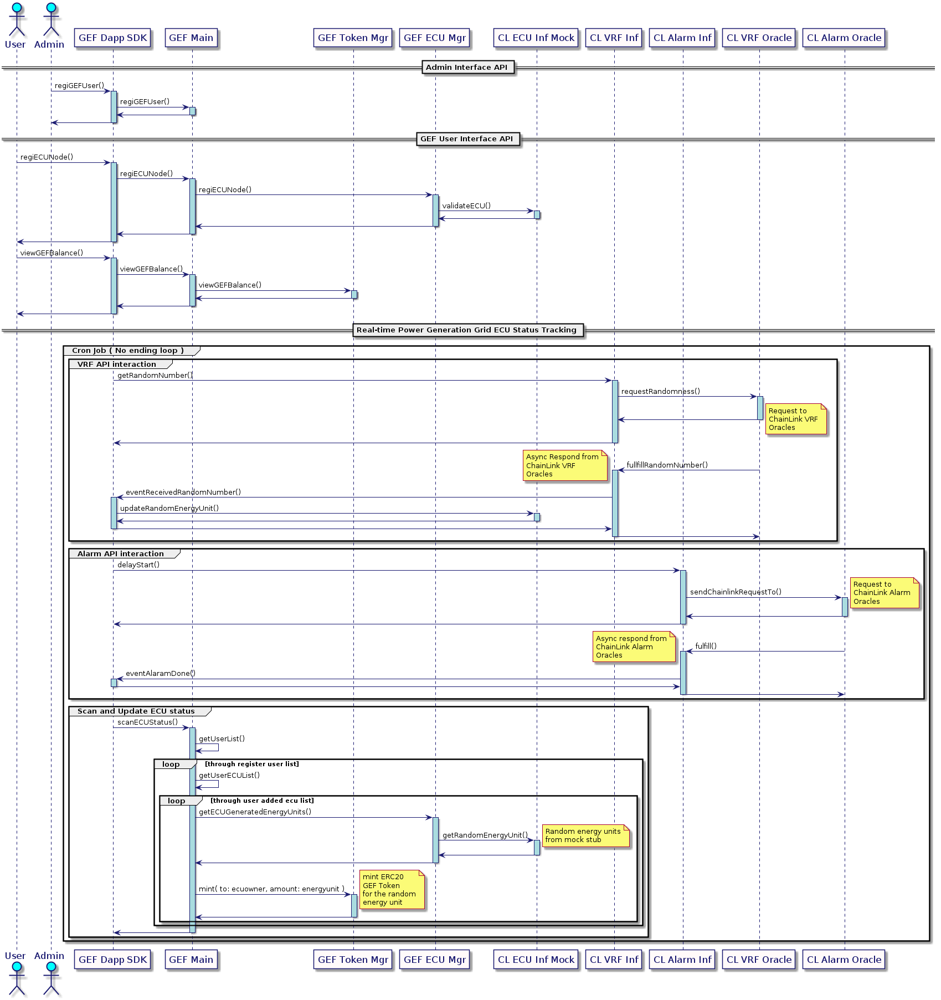

# Green Energy Farm ( GEF ) Token

**Wondering the possibility of distributed green power generation grids ...**

Ideation and proof-of-concept (POC) model is developed for [ chainlink-virtual-hackathon-2020 | Build the next generation of universally connected smart contracts]( https://chainlink-hackathon.devpost.com/ ) challenge.

Thanks to Chainlink API's, oracle, bridge adopters and decentralised node clusters. Supports to
bring real-world assert state into blockchain in realtime.

In this POC, explored the possibility of automating the real-time tracking of the energy generated
by Green Energy Farm like ( Solar Power Grids ), transform them into universally connected energy tokens.

---
## HighLevel Architecture


__TODO:: GEF ECU Oracles (Red path) is not existing/developed/incomplete__

---

## Overview

### Static Model


### Dynamic Model

**Image Source :: ./docs/gef-seq.png**



---

## Howto Install & Run

```shell
master$ yarn install
yarn install v1.22.4
[1/4] Resolving packages...
[2/4] Fetching packages...

master$ yarn run clean
yarn run v1.22.4
$ rm -rf ./artifacts ./build ./cache
Done in 0.07s.

master$ yarn run build
yarn run v1.22.4
$ yarn run build:contracts && yarn run build:typescript && yarn run build:copy
$ buidler compile
$(process.argv.length)
Prepending SPDX License Identifier to 62 sources: ISC
Compiling...
Downloading compiler version 0.6.6

```

```shell
master$ env DEBUG="debug*,info*,error*" yarn run test --network kovan
yarn run v1.22.4
$ yarn run test:contracts --network kovan
$ cross-env SOLPP_FLAGS="FLAG_IS_TEST,FLAG_IS_DEBUG" buidler test --show-stack-traces --network kovan
$(process.argv.length)
Prepending SPDX License Identifier to 62 sources: ISC
Compiling...

Compiled 74 contracts successfully

  GEFMain Test
  info:GEFMain-Test Admin :: 0xAECD01bB15873eC2BE8d28d01f5D176A65D0ACD3 +0ms
  info:GEFMain-Test Own1 :: 0xEE6d7d299896a86c5dcF4a7E2595F7b5d6206659 +1ms
  info:GEFMain-Test Own2 :: 0x15Ff0CA4c64045c1193230871DEfBA6593D328Ee +0ms
  debug:deploy-contract No deployed AddressResolver found. Deploying... +0ms
  info:deploy-contract Deployed AddressResolver to 0x211366A571C68A4536ec39136fa380243F3Ce3E8 +0ms
  debug:deploy-contract Deploying ECUManager with params: [0x211366A571C68A4536ec39136fa380243F3Ce3E8]... +15s
  info:deploy-contract Deployed ECUManager at address 0x33dB16Af7db9B579247Ee6200559f79634e7f0f8. +15s
  debug:deploy-contract ECUManager deploy tx (hash: 0x569e1c4fada8731063edc7a699507c277601c08f219900fb43634d074a62b92d) used 741286 gas. +11s
  debug:deploy-contract Registering ECUManager with AddressResolver +1ms
  debug:deploy-contract Registered ECUManager with AddressResolver (0x211366A571C68A4536ec39136fa380243F3Ce3E8) +11s
  debug:deploy-contract Deploying GEFTokenManager with params: [0x211366A571C68A4536ec39136fa380243F3Ce3E8,Green Energy Farm,GEF]... +2s
  info:deploy-contract Deployed GEFTokenManager at address 0x48968Eb77259D236Db6Ce5F4Db85727181819AEC. +24s
  debug:deploy-contract GEFTokenManager deploy tx (hash: 0xcc12ac0f94c5854951ff403c987bfb2199326b8b2b831f3ec3c054573e843e42) used 1824636 gas. +12s
  debug:deploy-contract Registering GEFTokenManager with AddressResolver +0ms
  debug:deploy-contract Registered GEFTokenManager with AddressResolver (0x211366A571C68A4536ec39136fa380243F3Ce3E8) +10s
  debug:deploy-contract Deploying CLIOAlarmManager with params: [0x211366A571C68A4536ec39136fa380243F3Ce3E8]... +2s
  info:deploy-contract Deployed CLIOAlarmManager at address 0xb0Eec24317348eF4e3CB20A59EaA8bA9a50d43fc. +20s
  debug:deploy-contract CLIOAlarmManager deploy tx (hash: 0x419a15fd59b3912ba2e80d171841e63216186732080b30983fb862b20d6b93d9) used 776277 gas. +8s
  debug:deploy-contract Registering CLIOAlarmManager with AddressResolver +0ms
  debug:deploy-contract Registered CLIOAlarmManager with AddressResolver (0x211366A571C68A4536ec39136fa380243F3Ce3E8) +10s
  debug:deploy-contract Deploying CLIOVRFManager with params: [0x211366A571C68A4536ec39136fa380243F3Ce3E8]... +2s
  info:deploy-contract Deployed CLIOVRFManager at address 0x3CFc6f7851237F41527E9daaa7Ca5254c920a606. +29s
  debug:deploy-contract CLIOVRFManager deploy tx (hash: 0x1c1284738ff431a2fdb86de6526dfeb72b0a5ee0db59faaabb400c245fe38ac9) used 561697 gas. +17s
  debug:deploy-contract Registering CLIOVRFManager with AddressResolver +0ms
  debug:deploy-contract Registered CLIOVRFManager with AddressResolver (0x211366A571C68A4536ec39136fa380243F3Ce3E8) +8s
  debug:deploy-contract Deploying GEFMain with params: [0x211366A571C68A4536ec39136fa380243F3Ce3E8]... +2s
  info:deploy-contract Deployed GEFMain at address 0x9B717142cD86bD1c18bCDb2c2D85921c2C002273. +21s
  debug:deploy-contract GEFMain deploy tx (hash: 0x7dc295bedd8df43f6cb59419857ec4efb6209d5281d2685084b8426e46da4e2f) used 707320 gas. +11s
  debug:deploy-contract Registering GEFMain with AddressResolver +0ms
  debug:deploy-contract Registered GEFMain with AddressResolver (0x211366A571C68A4536ec39136fa380243F3Ce3E8) +10s
  info:deploy-contract GEFMain at address 0x9B717142cD86bD1c18bCDb2c2D85921c2C002273 added as Minter +23s
  debug:GEFMain-Test VRF Proxy Cont @ 0x2CB302a16008fA21341eDeacF7AfE6Da2c3D0896 +0ms
  debug:GEFMain-Test VRF Impl Cont @ 0x3CFc6f7851237F41527E9daaa7Ca5254c920a606 +0ms
  debug:GEFMain-Test Alarm Proxy Cont @ 0x72543F9c9172Fa71Aa01662AF938f23F4Fde2Fe8 +16s
  debug:GEFMain-Test Alarm Impl Cont @ 0xb0Eec24317348eF4e3CB20A59EaA8bA9a50d43fc +0ms
  debug:GEFMain-Test wallet LT Balance  :: 177.0 +4s
  debug:GEFMain-Test Alarm proxy LT Balance :: 8.7 +1ms
  debug:GEFMain-Test wallet LT Balance  :: 177.0 +4s
  debug:GEFMain-Test VRF proxy LT Balance :: 10.0 +0ms
    ✓ Register User Owner1 (9533ms)
  debug:GEFMain-Test wallet LT Balance  :: 177.0 +13s
  debug:GEFMain-Test Alarm proxy LT Balance :: 8.7 +0ms
  debug:GEFMain-Test wallet LT Balance  :: 177.0 +3s
  debug:GEFMain-Test VRF proxy LT Balance :: 10.0 +1ms
    ✓ Register ECU Node (8088ms)
  debug:GEFMain-Test wallet LT Balance  :: 177.0 +12s
  debug:GEFMain-Test Alarm proxy LT Balance :: 8.7 +0ms
  debug:GEFMain-Test wallet LT Balance  :: 177.0 +3s
  debug:GEFMain-Test VRF proxy LT Balance :: 10.0 +0ms
  info:GEFMain-Test iter count :: 1 +4m
  debug:GEFMain-Test TS @ iter start Mon Sep 21 2020 08:54:24 GMT+0530 (India Standard Time) +1ms
  info:GEFMain-Test ReqID :: 0x58e61632de982dcbf09aa11f96cd6c22f2035ce4161c24a634376da358ec35f6 +1m
  debug:GEFMain-Test TS @ iter end Mon Sep 21 2020 08:55:44 GMT+0530 (India Standard Time) +1m
  debug:GEFMain-Test 1 :: GEF Balance :: 97 +10s
    ✓ Update ECU Status (89294ms)


  3 passing (5m)

Done in 324.03s.

```

## Note on BuidlerConfig | "kovan" network settings

Below settings are imported from env file **".env.shamb0.lab1"**


Create and adopt the file **".env.shamb0.lab1"** as per your environment.


---

## Shoutout

Thanks to @alcuadrado & @abcoathup for supporting & guiding to resolve some bringup issues ...


